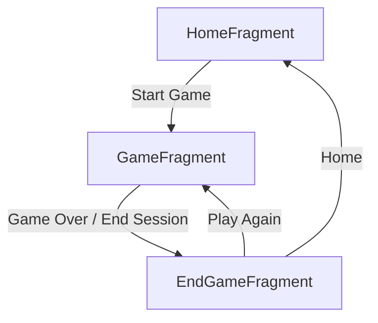

# MentalMath — Architecture & Roadmap

## Table of Contents

- [MentalMath — Architecture \& Roadmap](#mentalmath--architecture--roadmap)
  - [Table of Contents](#table-of-contents)
  - [Overview](#overview)
  - [How the App Works](#how-the-app-works)
    - [Navigation Flow](#navigation-flow)
    - [Game Lifecycle](#game-lifecycle)
    - [Question Generation](#question-generation)
    - [Scoring](#scoring)
    - [Game Modes](#game-modes)
    - [Difficulty Presets](#difficulty-presets)
    - [Statistics Persistence](#statistics-persistence)
  - [Architectural Decisions](#architectural-decisions)
    - [Singleton GameManager](#singleton-gamemanager)
    - [Enum-Driven Configuration](#enum-driven-configuration)
    - [View Binding over Compose](#view-binding-over-compose)
    - [DialogFragment for Custom Config](#dialogfragment-for-custom-config)
    - [SharedPreferences over Room](#sharedpreferences-over-room)
    - [Package Structure](#package-structure)
  - [Current Bugs](#current-bugs)
  - [Roadmap — Potential Improvements](#roadmap--potential-improvements)
    - [Immediate Fixes](#immediate-fixes)
    - [Architecture \& Maintainability](#architecture--maintainability)
    - [Feature Additions](#feature-additions)
    - [Testing](#testing)
    - [Polish \& UX](#polish--ux)

---

## Overview

MentalMath is an Android training app that generates arithmetic questions across configurable difficulty levels and game modes. It is written entirely in Kotlin, targets SDK 36, and uses Jetpack Navigation + Material 3 + View Binding with a single-Activity, multi-Fragment architecture.

---

## How the App Works

### Navigation Flow



The navigation graph (`res/navigation/nav_graph.xml`) defines three destinations with these transitions:

| Action | Trigger | Behavior |
|---|---|---|
| Home → Game | "Start Game" button | Configures game state from selected difficulty/mode, calls `GameManager.startGame()`, navigates |
| Game → End | Game over condition or "End Session" | Saves result to `StatsManager`, navigates |
| End → Game | "Play Again" button | Calls `GameManager.startGame()`, navigates (pops Home) |
| End → Home | "Home" button | Navigates to Home (pops Home inclusive) |

Custom difficulty intercepts at the Home screen: instead of navigating directly, it shows a `CustomDifficultyDialog` which then navigates to `GameFragment` on completion.

### Game Lifecycle

1. **HomeFragment**: User selects difficulty chip (Easy/Medium/Hard/Custom) and mode chip (Timed/Endless/Survival), then taps "Start Game."
2. **For preset difficulties**: `GameManager.config = getDefaultConfig(difficulty)` sets the config, then `GameManager.startGame()` resets all state.
3. **For Custom difficulty**: `CustomDifficultyDialog` constructs a custom `DifficultyConfig` from user-provided fields, sets `GameManager.config`, calls `GameManager.startGame()`, then navigates.
4. **GameFragment** (`onViewCreated`): Calls `showNextQuestion()` which calls `GameManager.generateQuestion()` and renders the question.
5. **On each answer submission**: `GameManager.submitAnswer()` checks correctness, updates score/streak/lives. Feedback is shown for 1.2s, then `showNextQuestion()` is called again.
6. **Game over** is checked after each answer. On game over, the fragment navigates to `EndGameFragment` after saving stats.

### Question Generation

All logic lives in `GameManager.kt`. A `generateQuestion()` call picks a random `QuestionType` from the active config's `questionTypes` list, then dispatches to one of four generators:

| Generator | Question Types | Key Helpers |
|---|---|---|
| `generateBasic()` | `BASIC` | `basicInt()` (from `config.basicNumbers`), `pickOp()` (from `config.operators`), `smallInt()` (always 2..12) |
| `generateCompound2()` | `COMPOUND_2` | `compInt()` (from `config.compoundNumbers`), `smallInt()` (always 2..12) |
| `generateCompound4()` | `COMPOUND_4` | `smallInt()`, `compInt()` |
| `generatePercentage()` | `PERCENTAGE` | `gcd()`-based clean-number generator, no config-dependent helpers |

**Key design notes on generation:**

- Subtraction is guaranteed non-negative by constraining the subtrahend (`b` in `a - b` is always `(1..a).random()`).
- Division always produces integer results by constructing `a = b * q` and asking `a ÷ b = q`.
- Compound patterns respect operator precedence (multiplication/division before addition/subtraction).
- The `smallInt()` range (2..12) is **not configurable by difficulty** — it is always the same regardless of preset.
- For Medium difficulty, `basicInt()` and `pickOp()` are **never called** because BASIC question types are not selected.
- Compound 4 patterns have fallback logic to adjust operands when intermediate results go negative.

### Scoring

```
score += 10 + (streak - 1)
```

- Every correct answer: base 10 points.
- Streak bonus: +(streak - 1) (i.e., +1 per consecutive correct beyond the first).
- Correct answer with streak = 1: 10 points.
- Correct answer with streak = 10: 19 points.
- Wrong answer resets streak to 0 and decrements lives (in Survival mode).
- The streak bonus is modest — 100 consecutive correct answers yield only a +99 bonus over flat 10pts each.

### Game Modes

| Mode | End Condition | HUD Display |
|---|---|---|
| **Timed** | `remainingTimeMs <= 0` | Countdown timer (MM:SS), no lives |
| **Endless** | Never (manual "End Session") | Score + streak only, no timer, no lives |
| **Survival** | `lives <= 0` | Heart symbols (`❤`), no timer |

The timer in Timed mode is a `CountDownTimer` created fresh per-question (the old one is cancelled first) that ticks every 100ms and decrements `GameManager.remainingTimeMs`.

### Difficulty Presets

Defined in `Models.kt` via `getDefaultConfig()`:

| Property | Easy | Medium | Hard | Custom (default) |
|---|---|---|---|---|
| `basicNumbers` | 1..20 | 1..50 | 1..100 | 1..20 |
| `compoundNumbers` | 1..10 | 1..20 | 1..30 | 1..20 |
| `operators` | +, − | +, −, ×, ÷ | +, −, ×, ÷ | +, − |
| `questionTypes` | BASIC | COMPOUND_2, PERCENTAGE | COMPOUND_4, PERCENTAGE | BASIC |
| `timeLimitSeconds` | 90 | 60 | 45 | 90 |
| `lives` | 5 | 3 | 2 | 5 |

**Notable progression:** The jump from Easy to Medium is steep (no BASIC questions — all compound and percentage). The jump to Hard switches to 4-operation compounds.

### Statistics Persistence

`StatsManager` is a singleton that uses `SharedPreferences` (`mental_math_stats`). It tracks five aggregated counters across **all** games, regardless of difficulty or mode:

| Key | Type | Update Rule |
|---|---|---|
| `games_played` | Int | Incremented by 1 per game |
| `total_questions` | Int | Added per-game question count |
| `total_correct` | Int | Added per-game correct count |
| `best_score` | Int | `maxOf(existing, new)` |
| `best_streak` | Int | `maxOf(existing, new)` |
| `total_time_ms` | Long | Added per-game duration |

Stats are displayed on the Home screen (conditionally, only after at least one game) and updated on `onResume`.

---

## Architectural Decisions

### Singleton GameManager

**Decision:** All mutable game state lives in `object GameManager` — a global singleton.

**Rationale:** Simple, no dependency injection framework needed. State is trivially accessible from any Fragment without wiring.

**Trade-offs:**
- (+) Zero boilerplate for state management
- (+) Easy to understand for a small codebase
- (−) No lifecycle awareness — state persists across configuration changes (which is actually desired here)
- (−) Singleton state + mutable `var`s make unit testing harder (state leaks between tests)
- (−) No separation of concerns — GameManager handles config, generation, scoring, and result building

### Enum-Driven Configuration

**Decision:** Difficulty presets are expressed as a pure function `getDefaultConfig(difficulty: Difficulty): DifficultyConfig` returning a data class with `IntRange`, `List<Operator>`, and `List<QuestionType>` fields.

**Rationale:** Type-safe, no magic strings, easy to add new presets. `IntRange` naturally models number ranges.

**Trade-offs:**
- (+) Compile-time safety for config fields
- (+) Adding a new difficulty is one `when` branch
- (−) Some config fields are unused for certain difficulties (Medium's `basicNumbers` and `operators` have no effect since BASIC questions aren't selected)

### View Binding over Compose

**Decision:** Uses View Binding (generated `*Binding` classes) with XML layouts.

**Rationale:** Stable, well-documented, minimal learning curve. The app's UI is simple enough that Compose's benefits (recomposition, state-driven UI) don't justify the migration cost.

**Trade-offs:**
- (+) Zero runtime overhead (unlike findViewById or Kotlin synthetics)
- (+) Familiar to any Android developer
- (−) XML layouts are verbose; the app uses multiple `ConstraintLayout` nesting levels
- (−) Manual `_binding` null-out pattern in `onDestroyView()` is boilerplate

### DialogFragment for Custom Config

**Decision:** Custom difficulty is implemented as a `DialogFragment` (backed by `AlertDialog`) rather than a separate screen.

**Rationale:** Custom configuration is an extension of the home screen selection, not a full navigation destination. A dialog keeps the flow modal and focused.

**Trade-offs:**
- (+) No extra navigation graph entry needed
- (+) Modal prevents accidental game start without reviewing settings
- (−) The dialog navigates directly (calls `findNavController().navigate()`) rather than returning a result to HomeFragment — this couples the dialog to navigation

### SharedPreferences over Room

**Decision:** Statistics are persisted with `SharedPreferences` rather than Room/SQLite.

**Rationale:** The data model is flat (5 counters), with no relational queries or complex aggregations. `SharedPreferences` is sufficient and simpler.

**Trade-offs:**
- (+) Zero setup, zero migrations
- (+) Synchronous reads, trivial API
- (−) No per-game records — can't show historical game list, per-difficulty stats, or charts
- (−) `apply()` is asynchronous — there's a theoretical (though unlikely) window where a crash loses the last save

### Package Structure

**Decision:** All 8 source files are in a single flat package (`com.example.mentalmath`).

**Rationale:** The codebase is small enough that subpackages add more navigation overhead than clarity.

**Trade-offs:**
- (+) Simple, everything is findable
- (−) As the app grows, the flat structure becomes disorganized. Subpackages (`model`, `game`, `ui`, `stats`) would help at ~15+ files.

---

## Roadmap — Potential Improvements

### Architecture & Maintainability

| Area | Suggestion | Rationale |
|---|---|---|
| **State management** | Migrate `GameManager` to a ViewModel per screen | ViewModels survive configuration changes naturally, are lifecycle-aware, and enable proper unit testing. `GameManager` could be split into `GameViewModel`, `HomeViewModel`, and `StatsRepository` |
| **Package structure** | Introduce subpackages: `model`, `game`, `ui.home`, `ui.game`, `ui.endgame`, `stats` | Scales better as files multiply; enforces separation of concerns |
| **Question generation** | Extract generators into dedicated classes/strategies | `GameManager` currently mixes state, generation, and scoring. A `QuestionGenerator` interface with `BasicGenerator`, `Compound2Generator`, etc. would be testable in isolation |
| **Result passing** | Use `SavedStateHandle` or `sharedViewModel` instead of reading from `GameManager` | EndGameFragment currently reads results from the singleton, which is fragile if the activity is recreated |
| **Custom dialog** | Use Fragment Result API or a `sharedViewModel` instead of direct navigation | Currently the dialog calls `findNavController().navigate()` directly, bypassing HomeFragment entirely |

### Feature Additions

| Feature | Description | Effort |
|---|---|---|
| **Per-difficulty stats** | Track best score, games played, accuracy separately per difficulty (and mode) | Medium — requires schema change, UI update, or migration to Room |
| **Historical game log** | Show a scrollable list of past games with date, difficulty, mode, score | Medium — requires Room or JSON file persistence |
| **Confirmation dialog for End Session** | Prevent accidental session termination in Endless mode | Small |
| **Animations** | Add transitions (correct/wrong feedback, question transitions, timer urgency) | Small-Medium |
| **Sound effects** | Correct/wrong answer audio feedback | Small |
| **Haptic feedback** | Vibrate on wrong answer | Trivial |
| **Share score** | Share result card as image or text | Small |
| **Dark mode** | The app already uses `DayNight` theme; ensure all colors adapt | Small — mostly XML/color values |
| **Leaderboard / Achievements** | Google Play Games integration | Large |
| **More question types** | Fractions, squares/roots, sequences, word problems | Medium-Hard |
| **Adaptive difficulty** | Adjust difficulty dynamically based on player performance | Medium |

### Testing

| Area | Current State | Suggested |
|---|---|---|
| **Unit tests** | None (only JUnit stub dependency) | Test `GameManager` question generation for correctness (each pattern, each difficulty). Test scoring math. Test edge cases (division by zero, negative answers, empty config) |
| **UI tests** | None (only Espresso stub) | Test navigation flow, chip selection persistence, feedback display, timer behavior, game-over flow |
| **Property-based tests** | None | Use kotlin-property or manual loops to verify that generated questions never produce negative results, overflow, or division by zero across all config combinations |

### Polish & UX

| Area | Suggestion |
|---|---|
| **Keyboard UX** | Auto-show keyboard on question transition; dismiss on submit; handle `numberSigned` vs `number` (currently `numberSigned` allows negative, but all answers are non-negative) |
| **Timer urgency** | Change color (green → yellow → red) as time runs low; add a subtle animation in the last 10 seconds |
| **Accessibility** | Add `contentDescription` to ImageView feedback icons; ensure sufficient color contrast; test with TalkBack |
| **Error feedback** | `etAnswer.error` is set but never cleared — it persists until the next question; clear it in `showNextQuestion()` |
| **Input type** | `numberSigned` allows negative input, but no generated question has a negative answer. Consider `number` unless future question types may produce negatives |
| **Layout polish** | The game screen uses a fixed 24dp padding; on large screens (tablets), the question text could be comically large while the input field stays the same. Consider responsive dimensions |
| **Empty state** | "No games played yet" message when stats section is hidden on first launch |
